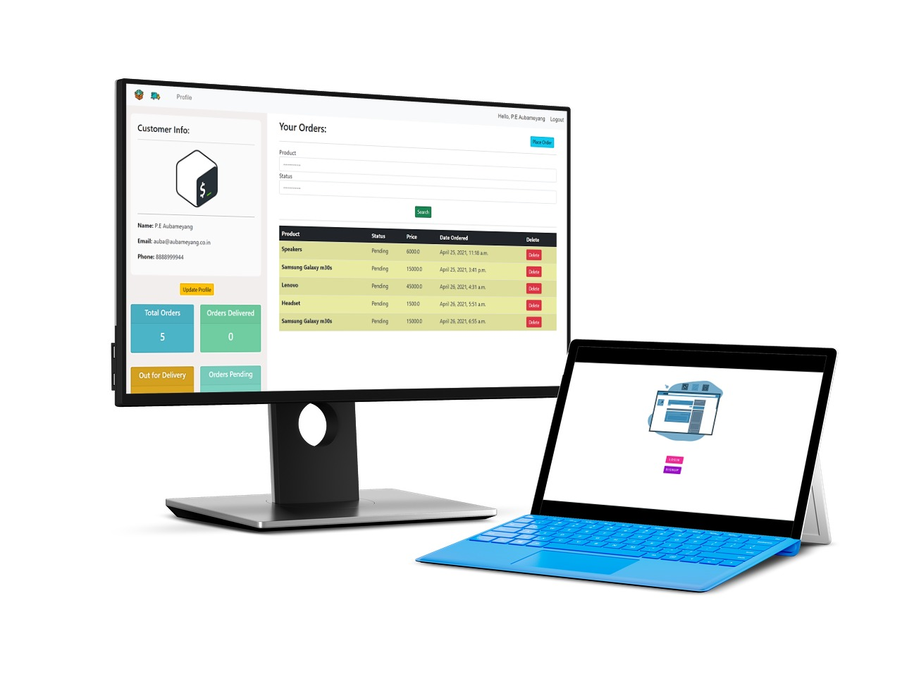
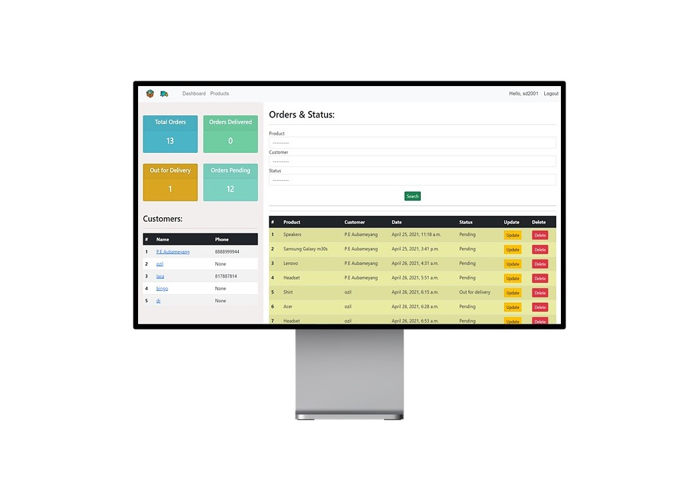

<div align="center"> 
  <p align='center'> 
   
   
   <br>
   
    <br>
   <br>
  </p>
 </div>
 
 <div align="center">
  <p>
  
  </p>
  <br>
  
 </div>
 <div align="center">
 <p>
 <br>
   <br>
   <br><strong>CRM-X</strong> is available under MIT License, read the LICENSE file for more info
  <p>
  </div><br>

<div align="center">  
  
 </div>
 <div align="center">
  <p>    
  <br>
</div>
 
  - **Fork** the Repository
  - Open your **Terminal / Cmd**
  
 <br>
 
   ```
   git clone https://github.com/sd2001/CRM-X.git   
   ```   

   ```
   cd CRM-X
   ```

   ```
   pip install virtualenv
   python -m venv <name of environment>
   source <name>/bin/activate
   pip install -r requirements.txt
   ```

   ```
   python manage.py runserver
   ```
 
 <div align="center">
  
  <br><br>
  
  
 </div><br>
 
 ```
   python manage.py makemigrations
   python manage.py migrate
   
   python manage.py createsuperuser
 ```
 
   <div align="center">
         
   </div><br>
   

 
 <div align="center">
  
 </div>
